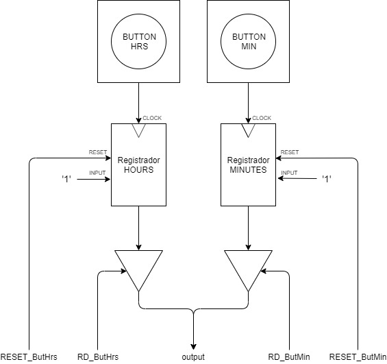

# Clock in a FPGA
Felippe Teracini, Guilherme Schoeri, Juan Garcia

# Table of Contents
1. [Introduction](#introduction)
2. [Clock Features](#clock-features)
3. [Pseudocode](#pseudocode)
4. [Instructions](#instructions)
5. [CU Signals](#cu-signals)
6. [Addressing Modes](#addressing-modes)
7. [Address and Register table](#address-and-register-table)
8. [Assembly](#assembly)
9. [Assembler](#assembler)
10. [CPU and ROM](#cpu-and-rom)
11. [IO](#io)
12. [Memory Mapping](#memory-mapping)
13. [How to use](#how-to-use)
14. [References](#references)


## Introduction
 The goal of the project was to create and implement an entire cpu archictecture from scratch to use as a clock engine. The cpu was, then, tested on FPGA Cyclone IV EP4CE115F29C7.

## Clock Features
* *AM/PM* mode
* Change clock basetime speed from normal to high 
* Change clock time (minutes or hours)


## Pseudocode
```javascript
h = 0;
m = 0;
s = 0;
reg = 0;
minuteButtonDown = 0;
hourButtonDown = 0;

while (1) {
   checkSecond();

   if (reg == 1) {
       s += 1;
       if(s == 60)
       {
           s = 0;
           m += 1;
       }
       if(m == 60)
       {
           m = 0;
           h += 1;
       }
       if(h == 24)
       {
           h = 0;
       }

       reg = 0;

       clearSecond();
   }

   checkMinuteButton();

   if (minuteButtonDown) {

       m += 1;

       if(m == 60)
       {
           m = 0;
           h += 1;
       }
       if(h == 24)
       {
           h = 0;
       }

       minuteButtonDown = 0;
   }

   checkHourButton();

   if (hourButtonDown) {

       h += 1;

       if(h == 24)
       {
           h = 0;
       }

       hourButtonDown = 0;
   }

   updateDisplayMinute();
   updateDisplayHour();

}
```
 

## Instructions

| Instructions        | Sintax           | OPCODE  |  Description                                 |
| ------------- |:----------------:|:------:|:----------------------------------------------------|
| ADD      | add reg, $immediate   | 000    | Adds reg value to immediate                         |
| CMP      | cmp reg, $immediate   | 001    | Compares reg's value to immediate and sets RD value |
| MOVI     | movi reg, $immediate  | 010    | Defines reg's value to immediate                    |
| JMP      | jmp label             | 011    | Jumps to label                                      |
| JMPNE    | jmpne label           | 100    | Jumps to label if RD = 1                            |
| null     |         null          | 101    | null                                                |
| LOAD     | load reg, $immediate  | 111    | Loads immediate RAM address value to reg            |
| STORE    | store reg, $immediate | 110    | Writes reg's value into the immediate RAM address   |

## CU Signals

| Instruction | OPCODE  | OP  | JMP | JMPNE | HABbanco| HABrd|MUX_ULA| RD  |   WR   |
| ----------- |:------: |:---:|:-----:|:-------:|:----:|:-----:|:---:|:-----:|:-----:|
| ADD         |  000    | 00   | 0     |    0    | 1    | 0     |0   |   0     |   0     |
| CMP         |  001    | 10   | 0     |    0    | 0    | 1     |0   |   0     |   0     |
| MOVI        |  010    | 01   | 0     |    0    | 1    | 0     |0   |   0     |   0     |
| JMP         |  011    | XX   | 1     |    0    | 0    | 0     |X   |   0     |   0     |
| JMPNE       |  100    | XX   | 0     |    1    | 0    | 0     |X   |   0     |   0     |
| null        |  101    | 00   | 0     |    0    | 0    | 0     |0   |   0     |   0    |
| LOAD        |  111    | 01   | 0     |    0    | 1    | 0     |1   |   1     |   0     |
| STORE       |  110    | XX   | 0     |    0    | 0    | 0     |0   |   0     |   1     |


## Addressing Modes
* **Word Length:** 14 bits
* **Total number of Instructions:** 8 registers
* **Total number of Registers:** 8 registers

| OPCODE        | REG          | Immediate  |  
| ------------- |:-------------:|:-------------:|
| 3 bits        | 3 bits        | 8 bits    |                        

| OPCODE        | Immediate     | 
| ------------- |:-------------:|
| 3 bits        | 11 bits       |                     


## Address and Register table

| REGISTER   NAME     | REGISTER ADDRESS  | 
| ------------- |:-------------:|
| hours         |      0        |         
| minutes       |      1        |  
| seconds       |      2        |
| time_base     |      3        |
| add_min       |      4        |
| add_hour      |      5        |
| 6             |      6        |         
| 7             |      7        |         


## Assembly
[Assembly Code](https://github.com/TeraByte900/Relogio_VHDL/blob/master/Assembly.txt "Assembly Code")

## Assembler
 There is also a python assembler for our processor assembly language. It was based on a MIPS assembler made provided by our teacher Eduardo Marossi. The assembler generates a `.mif` file that is load on the ROM.
 
[Assembler Code](https://github.com/TeraByte900/Relogio_VHDL/blob/master/watch_assembler.py "Assembler's code")

[Assembly .mifs](https://github.com/TeraByte900/Relogio_VHDL/blob/master/initROM.mif "Generated .mif")


## CPU and ROM


## IO



## Memory Mapping

|  ADDR  | RD | WR | | EnableSec | EnableMin | EnableHrs | RD_BaseTempo | RESET_BaseTempo | RD_ButMin | RESET_ButMin | RD_ButHrs | RESET_ButHrs |
|:------:|----|----|-|-----------|-----------|-----------|--------------|-----------------|-----------|--------------|-----------|--------------|
|  0x00  |  1 |  0 | |     0     |     0     |     0     |       1      |        0        |     0     |       0      |     0     |       0      |
|  0x00  |  0 |  1 | |     0     |     0     |     0     |       0      |        1        |     0     |       0      |     0     |       0      |
|  0x01  |  1 |  0 | |     0     |     0     |     0     |       0      |        0        |     1     |       0      |     0     |       0      |
|  0x01  |  0 |  1 | |     0     |     0     |     0     |       0      |        0        |     0     |       1      |     0     |       0      |
|  0x02  |  1 |  0 | |     0     |     0     |     0     |       0      |        0        |     0     |       0      |     1     |       0      |
|  0x02  |  0 |  1 | |     0     |     0     |     0     |       0      |        0        |     0     |       0      |     0     |       1      |
|  0x03  |  0 |  1 | |     0     |     1     |     0     |       0      |        0        |     0     |       0      |     0     |       0      |
|  0x04  |  0 |  1 | |     0     |     0     |     1     |       0      |        0        |     0     |       0      |     0     |       0      |
|  0x05  |  0 |  1 | |     1     |     0     |     0     |       0      |        0        |     0     |       0      |     0     |       0      |
| OTHERS |  0 |  0 | |     0     |     0     |     0     |       0      |        0        |     0     |       0      |     0     |       0      |

## How-to-use
 ### 1. Using the assembler:
  First install *python 3.7*.
 
  #### 1.1. to reproduce the project:
   To create the `.mif` code responsible for the Clock on the FPGA, using python 3.7 run `python3 watch_assembler.py -mif    Assembly.txt > initROM.mif`
  #### 1.2. creating your own mif:
   To create your `.mif` code first you need a assembly file that has the **exact same instructions and sintax** explained above. You may need/want to alter the dict table on `def get_register(self, register):` in the `watch_assembler.py` if you need to alter the names of the registers.
   
 ### 2. Using the clock:
  | Switch/Button     | Status      | Functionality       |
  | ----------------- |:-----------:|:-------------------:|
  | SW[14]            |  UP         |  Fast Speed         |
  | SW[14]            |  DOWN       |  Normal Speed       | 
  | SW[17]            |  UP         |  12Hrs AM/PM Clock  |
  | SW[17]            |  DOWN       |  24Hrs Clock        |
  | KEY[0]            |  ON PRESS   |  Add 1 to minutes   |
  | KEY[1]            |  ON PRESS   |  Add 1 to hours     |     
  
## References
[VHDL Quick Reference Card da Synthworks.](http://www.synthworks.com/downloads/vhdl_quickref.pdf)

[VHDL Types & Package Quick Reference Card da Synthworks.](http://www.synthworks.com/downloads/type_pkg_quickref.pdf)


___

